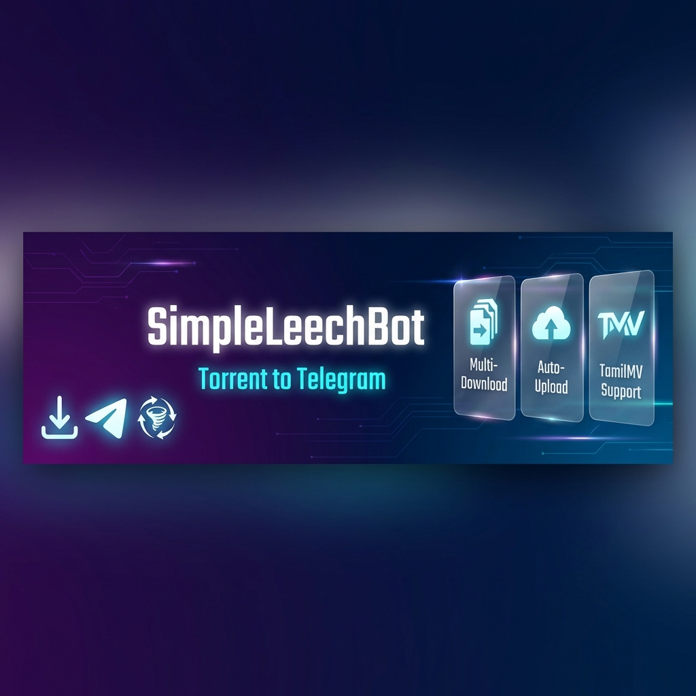

<div align="center">



# SimpleLeechBot

### 🚀 Advanced Telegram Torrent Leech Bot

[](https://www.python.org/)
[](https://docs.docker.com/)
[](https://docs.pyrogram.org/)
[](LICENSE)

[Features](#-features) • [Installation](#-installation) • [Commands](#-commands) • [Ban Prevention](#%EF%B8%8F-ban-prevention)

</div>

---

## ✨ Features

### Core Functionality
- 🧲 **Magnet Link Support** - Direct torrent downloads via qBittorrent
- 📁 **Multi-File Handling** - Automatic folder uploads with natural sorting
- 📤 **Multi-Channel Upload** - Upload to multiple Telegram channels simultaneously
- 🌐 **TamilMV Integration** - Auto-scrape and queue magnets from TamilMV posts
- � **Direct Link Generator** - Create 3-hour shareable download links from magnets
- �🖼️ **Custom Thumbnails** - Per-user thumbnail support
- 📏 **Smart Size Filtering** - 2GB/4GB configurable limits
- 🗑️ **Auto-Cleanup** - Files deleted immediately after upload

### Queue Management
- 🔢 **Concurrent Downloads** - 3 simultaneous downloads (safe limit)
- ⏳ **Pending Queue** - Auto-queue 4th+ downloads
- 📊 **Progress Bars** - Visual `[████████░░]` style indicators
- ❌ **Individual Cancellation** - Cancel any download by hash
- 🔄 **Auto-Resume** - Pending downloads start automatically when slots free

### Advanced Features
- 🛡️ **Rate Limiting** - Smart throttling to prevent API bans
- 💾 **Storage Channel Mode** - Upload to private channel (safer)
- 🗑️ **Auto-Delete Messages** - Bot messages auto-delete after 10s
- 📝 **Filename Cleaning** - Remove unwanted patterns (www.TamilMV, etc.)
- 🔍 **Duplicate Detection** - Hash-based duplicate prevention
- 📊 **Real-time Monitoring** - `/limits` command shows current API usage
- 🔎 **Torrent Search** - Search multiple torrent sites (1337x, YTS, PirateBay, Nyaa)
- ⏰ **Link Expiration** - Direct links auto-expire after 3 hours

---

## 🛡️ Ban Prevention

This bot implements multiple safety measures to prevent Telegram account bans:

| Feature | Implementation | Benefit |
|---------|----------------|---------|
| **Rate Limiter** | Max 8 uploads/min, 12 messages/min | 40-60% below Telegram limits |
| **Auto-Delete** | Messages delete after 10s | Reduces chat spam flags |
| **Storage Channel** | Upload to private channel | Safer than private chats |
| **Conservative Limits** | 3 concurrent downloads | Less aggressive than competitors |
| **FloodWait Buffer** | +10s recovery time | Safer error handling |

---

## 📦 Installation

### Docker Deployment (Recommended)

```bash
# Clone the repository
git clone https://github.com/Mady93823/tamilmvleechbot.git
cd tamilmvleechbot

# Configure environment
cp config_sample.env config.env
# Edit config.env with your credentials

# Build and run
./rebuild.sh
```

### Manual Installation

```bash
# Clone
git clone https://github.com/Mady93823/tamilmvleechbot.git
cd tamilmvleechbot

# Install dependencies
pip install -r requirements.txt

# Configure
cp config_sample.env config.env
# Edit config.env

# Run qBittorrent
qbittorrent-nox --configuration ./qbit_config &

# Start bot
python bot.py
```

---

## ⚙️ Configuration

Edit `config.env`:

| Variable | Description | Required |
|----------|-------------|----------|
| `BOT_TOKEN` | Telegram Bot Token from [@BotFather](https://t.me/BotFather) | ✅ |
| `API_ID` | Telegram API ID from [my.telegram.org](https://my.telegram.org) | ✅ |
| `API_HASH` | Telegram API Hash | ✅ |
| `OWNER_ID` | Your Telegram User ID | ✅ |
| `MONGO_URI` | MongoDB connection string | ✅ |
| `DOWNLOAD_DIR` | Download directory (default: `downloads/`) | ❌ |
| `QB_HOST` | qBittorrent host (default: `localhost`) | ❌ |
| `QB_PORT` | qBittorrent port (default: `8090`) | ❌ |

---

## 🎮 Commands

| Command | Description | Auto-Delete |
|---------|-------------|-------------|
| `/start` | Welcome message | ❌ |
| `/help` | Show all commands | ✅ |
| `/settings` | Configure bot settings | ❌ |
| `/queue` | View active downloads with progress | ❌ |
| `/cancel` | Cancel a download | ❌ |
| `/setthumb` | Set custom thumbnail (reply to photo) | ❌ |
| `/setchannels` | Configure upload channels<br>`/setchannels -1001234567 \| -1009876543` | ❌ |
| `/setstorage` | Set storage channel (safer mode) | ✅ |
| `/search <query>` | Search torrents from multiple sites | ❌ |
| `/dirlink <magnet>` | Generate 3-hour direct download link | ❌ |
| `/getlink [ID]` | Download file by link ID or list active links | ❌ |
| `/limits` | Check current rate limit status | ✅ |
| `/rebuild` | **Admin:** Free up space and rebuild bot | ❌ |
| `/retry <link>` | **Admin:** Manually retry magnet/topic | ❌ |
| `/stats` | **Admin:** Show system statistics | ✅ |

---

## 🎯 Usage

### Download Magnets
Simply send a magnet link:
```
magnet:?xt=urn:btih:1234567890abcdef...
```

### TamilMV Auto-Scrape
Send a TamilMV post URL:
```
https://www.1tamilmv.rsvp/index.php?/forums/topic/12345-movie-name/
```
Bot will:
1. Scrape all magnet links
2. Filter by your size setting (2GB/4GB)
3. Auto-queue all matching magnets
4. Process up to 3 concurrently

### Direct Link Generator
Create shareable download links without uploading to Telegram:
```
/dirlink magnet:?xt=urn:btih:1234567890abcdef...
```
The bot will:
1. Download the file to `directdownloads/` directory
2. Generate a unique link ID
3. Provide a 3-hour valid link
4. Auto-delete file after expiration

To download:
```
/getlink [ID]  # Download specific file
/getlink       # List all active links
```

### Torrent Search
Search across multiple torrent sites:
```
/search avengers
```
Choose a site (1337x, YTS, PirateBay, Nyaa) and view results in Telegraph.

### Set Storage Channel
1. Create a private channel
2. Add bot as admin
3. Send `/setstorage -1001234567890` (use your channel ID)
   - OR forward any message from channel to bot (public channels only)
4. All future uploads go there (safer!)

---

## 📊 Feature Comparison

| Feature | SimpleLeechBot | Other Bots |
|---------|----------------|------------|
| Concurrent Downloads | 3 (safe) | 5-10 (risky) |
| TamilMV Support | ✅ Auto-scrape | ❌ Manual |
| Rate Limiting | ✅ Built-in | ❌ None |
| Auto-Delete Messages | ✅ Yes | ❌ No |
| Storage Channel | ✅ Yes | ❌ No |
| Direct Links | ✅ 3-hour expiry | ❌ No |
| Torrent Search | ✅ Multi-site | ⚠️ Limited |
| Ban Protection | ✅ Multiple layers | ⚠️ Basic |
| Progress Bars | ✅ Visual | ✅ Text only |
| Multi-Channel | ✅ Unlimited | ⚠️ Limited |

---

## 🏗️ Architecture

```
SimpleLeechBot/
├── bot.py                    # Main bot logic
├── rate_limiter.py          # Rate tracking & throttling
├── auto_delete.py           # Auto-delete utility
├── storage_channel.py       # Channel management
├── storage_utils.py         # Disk space checking
├── management_commands.py   # Admin commands (/rebuild, /retry, /stats)
├── tamilmv_handler.py       # TamilMV integration
├── plugins/
│   ├── tamilmv_scraper.py  # Web scraping
│   └── rss_monitor.py       # RSS feeds (1-hour intervals)
├── settings.py              # MongoDB settings
├── channel_utils.py         # Multi-channel logic
├── rename_utils.py          # Filename cleaning
├── thumb_utils.py           # Thumbnail handling
└── progress.py              # Progress bars
```

---

## 🔒 Security

- ✅ Owner-only access (OWNER_ID verification)
- ✅ MongoDB authentication
- ✅ qBittorrent WebUI auth
- ✅ No plaintext credential storage
- ✅ Auto-file deletion after upload
- ✅ Rate limiting to prevent abuse

---

## 🐛 Known Issues

- ⚠️ Upload delay not fully integrated (needs 8s between files)
- ⚠️ Requires new BOT_TOKEN if previously banned

---

## 🚀 Upcoming Features

- [ ] Complete rate limiter upload integration
- [ ] Auto-delete for all status messages
- [ ] RSS monitoring for automatic downloads
- [ ] Multi-source support (1337x, RARBG mirrors)
- [ ] Upload resume support
- [ ] Torrent search command

---

## � Credits

- Built with ❤️ by **Antigravity**
- Powered by [Pyrogram](https://github.com/pyrogram/pyrogram) & [qBittorrent](https://www.qbittorrent.org/)
- Inspired by [KPS Bot](https://telegram.me/KPSLeechBot)

---

## 📄 License

This project is licensed under the MIT License - see the [LICENSE](LICENSE) file for details.

---

## ⚠️ Disclaimer

This bot is for educational purposes only. Users are responsible for complying with their local laws and Telegram's Terms of Service. The developers are not responsible for any misuse of this software.

---

<div align="center">

**Made with 🤖 by Antigravity**

[Report Bug](https://github.com/Mady93823/tamilmvleechbot/issues) • [Request Feature](https://github.com/Mady93823/tamilmvleechbot/issues)

</div>
